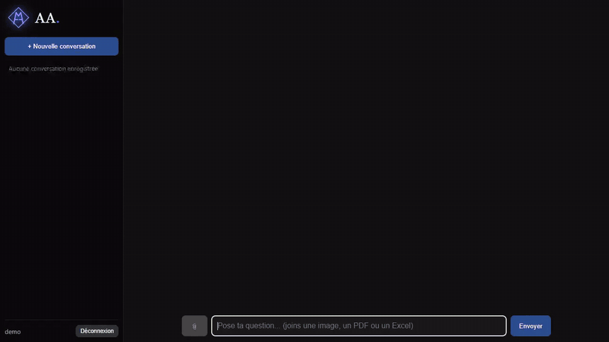
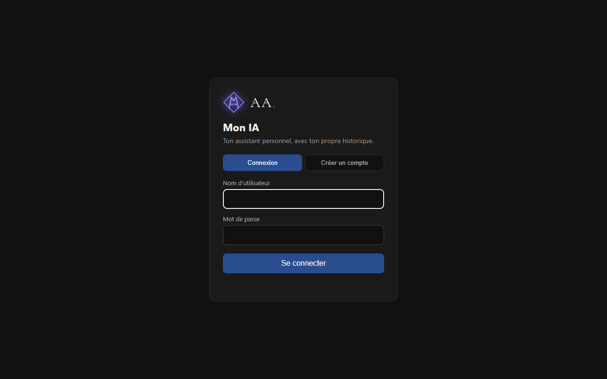
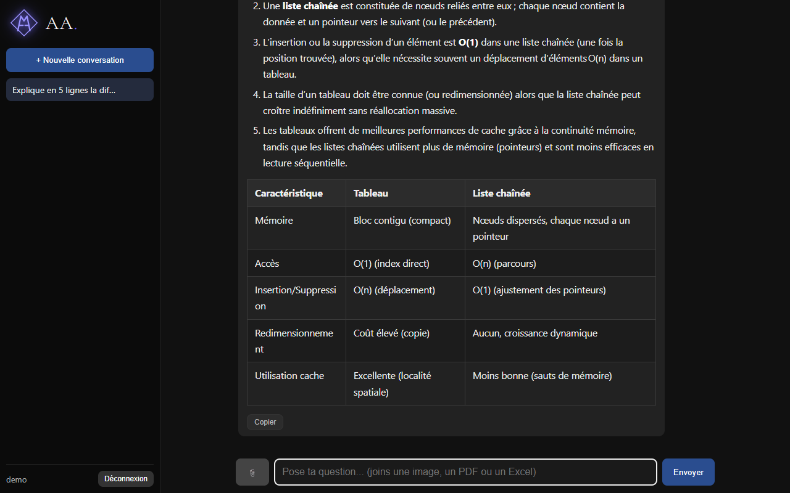
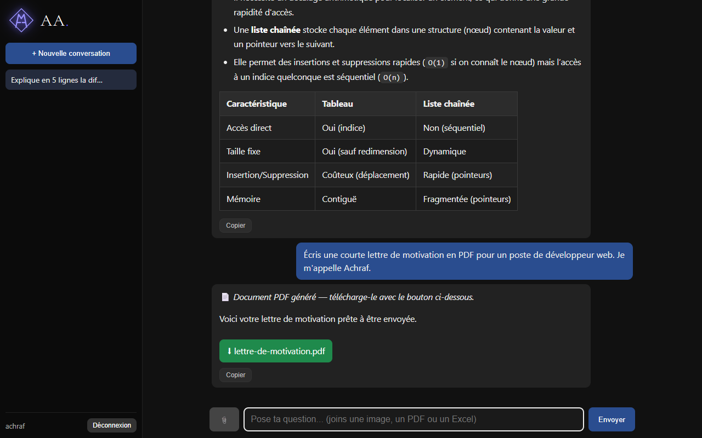
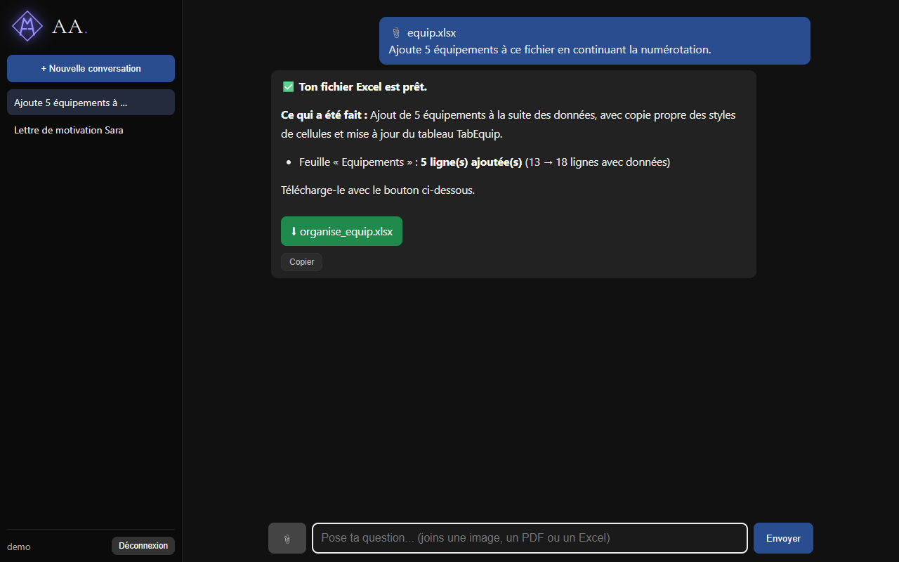
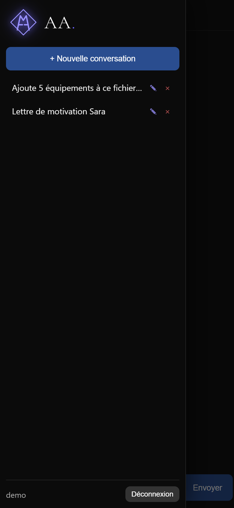

# AA. · Mon IA

**Assistant IA personnel, gratuit, avec comptes utilisateurs et historique privé.**
Il répond sur tous les sujets (code, cuisine, droit, voyages…), lit des PDF, des images et des fichiers Excel, et **génère des fichiers Word, PDF et Excel** à télécharger.

🔗 **https://achraf-agent.vercel.app** · accès **privé sur invitation** : seules les personnes disposant d'une *clé d'accès* peuvent créer un compte.



## Fonctionnalités

- 💬 **Chat sur tous les domaines**, réponses mises en forme (titres, listes, tableaux, code), avec **recherche web** pour l'actualité
- 👤 **Comptes utilisateurs** : chaque personne a son propre historique de conversations (renommer, supprimer, copier une réponse)
- 📄 **Lecture de PDF** et d'**images** (analyse, résumé, questions)
- 📊 **Excel** : envoie un classeur et dis ce que tu veux (« trie par date », « ajoute 20 équipements », « mets en forme ») → le fichier modifié est à télécharger *(la modification est désactivée sur le site en ligne par sécurité ; l'analyse reste possible. Active-la en local ou sur ton propre déploiement avec `ENABLE_EXCEL_SCRIPTS=1`)*
- 📝 **Création de documents** Word et PDF (lettres, CV, rapports) à partir d'une simple demande
- 🔁 **Bascule automatique entre fournisseurs d'IA gratuits** quand l'un est saturé ou en panne (Groq → Gemini → …), avec messages d'erreur lisibles
- 📱 **Responsive** : menu coulissant sur mobile

## Aperçu

| Connexion | Conversation |
|---|---|
|  |  |
| **Création d'un document** | **Excel modifié** |
|  |  |

| Mobile | Menu mobile |
|---|---|
|  |  |

## Technologies

| | |
|---|---|
| **Backend** | Python 3.12 (serveur HTTP standard), SQLAlchemy 2 |
| **Base de données** | SQLite en local · PostgreSQL (Neon) en ligne |
| **IA** | API compatibles OpenAI : Groq (gpt-oss, Qwen), Google Gemini, OpenRouter |
| **Fichiers** | pypdf (lecture PDF) · openpyxl (Excel) · python-docx (Word) · reportlab (PDF) |
| **Frontend** | HTML / CSS / JavaScript natif, marked + DOMPurify (rendu Markdown sécurisé) |
| **Hébergement** | Vercel (fonction Python) + Neon, entièrement gratuit |

## Comment ça marche

- **Fournisseurs en cascade** : chaque requête essaie les modèles dans l'ordre ; un modèle en panne ou dont le quota est épuisé est mis en pause automatiquement.
- **Excel** : l'IA écrit un script Python (openpyxl) qui est **vérifié** (imports autorisés, pas d'accès fichiers/réseau) puis exécuté dans un processus isolé **sans aucune clé d'API**. Le résultat est contrôlé (fichier réellement modifié, pas de lignes perdues loin sous les données) avant d'être proposé au téléchargement.
- **Documents** : l'IA rédige en Markdown, converti en `.docx` et `.pdf` côté serveur.
- **Sécurité** : mots de passe hachés (scrypt), sessions en cookie `HttpOnly`/`SameSite`, protection CSRF, limitation des tentatives de connexion, quota de messages par jour, clé d'accès obligatoire à l'inscription (une clé par personne, révocable), isolation stricte des données entre utilisateurs.

## Lancer en local

```bash
pip install -r requirements.txt
cp .env.example .env        # puis colle au moins une clé gratuite (Groq ou Gemini)
python web.py               # http://localhost:8002
```

Clés gratuites : [Groq](https://console.groq.com/keys) · [Gemini](https://aistudio.google.com/apikey).
Optionnel : `pip install -r requirements-pandas.txt` pour des modifications Excel plus puissantes (trop lourd pour Vercel).

## Déploiement

Voir [DEPLOIEMENT.md](DEPLOIEMENT.md) (Vercel + Neon, ou Render).
Variables : `DATABASE_URL`, `GROQ_API_KEY`, `GEMINI_API_KEY`, `SIGNUP_CODE`, `DAILY_LIMIT`, `ENABLE_EXCEL_SCRIPTS`.

## Limites connues

- Modèles gratuits : quotas partagés entre tous les utilisateurs, la qualité varie selon le modèle disponible.
- Pas de « mot de passe oublié » ni de suppression de compte.
- Sur Vercel : fichiers envoyés limités à ~3 Mo, réponse en moins de 60 s.

## Auteur

**Achraf Aachchak** · [GitHub @achraf06011](https://github.com/achraf06011)

Licence [MIT](LICENSE)
